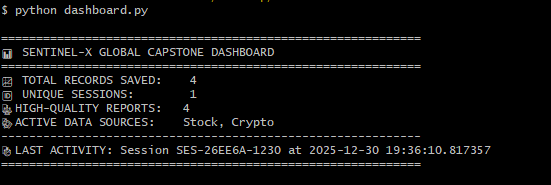

# Sentinel-X: Multi-Agent Intelligence Stream

Sentinel-X is a sophisticated **Multi-Agent System (MAS)** designed to automate the collection, evaluation, and reporting of live-streamed market data. This project serves as a capstone demonstration of autonomous agent orchestration, state management, and long-term memory integration.

## 🚀 Core Features & Capstone Requirements

| Requirement | Implementation Detail |
| :--- | :--- |
| **Multi-Agent System** | Orchestrates 4+ specialized agents: Researchers, Aggregator, Judge, and Lead Reporter. |
| **Agent Evaluation** | Integrated **Judge Agent** that scores data signal-to-noise ratios before human intervention. |
| **State & Sessions** | Unique `UUID` session tracking (`SES-XXXXXX`) to maintain lineage across system restarts. |
| **Long-Term Memory** | Persistent SQLite **Memory Bank** for historical data storage and retrieval. |
| **Human-in-the-Loop** | Prefect-powered **Pause/Resume** logic for manual verification of high-signal intelligence. |
| **A2A Protocol** | Standardized data handshakes between autonomous agents to ensure context integrity. |
| **Observability** | Real-time metrics dashboard tracking total records, session counts, and agent accuracy. |

## 🛠️ Architecture


1.  **Parallel Researchers**: Concurrently fetch data from multiple mock streams (Crypto/Stocks).
2.  **Context Aggregator**: Performs context engineering to compact raw data into a unified payload.
3.  **Judge Agent (RAG)**: Queries the **Memory Bank** to identify duplicates and evaluate data quality.
4.  **Lead Reporter**: Formats final briefings for the executive layer upon human approval.

## 📦 Project Structure

* `sentinel_x.py`: Main agent logic and Prefect workflow.
* `dashboard.py`: Observability tool for system metrics.
* `view_memory.py`: Database viewer for session and state inspection.
* `capstone.db`: SQLite Long-Term Memory storage.

## 🚦 Getting Started

1. **Install Dependencies**:
   ```bash
   pip install prefect
   
2. Start the Orchestrator:
   
   prefect server start

4. Launch Sentinel-X:
   
   python sentinel_x.py

6. View Performance:
   
   python dashboard.py

## 📸 Project Previews

### 📊 System Performance Dashboard


### 🧠 Long-Term Memory Bank

